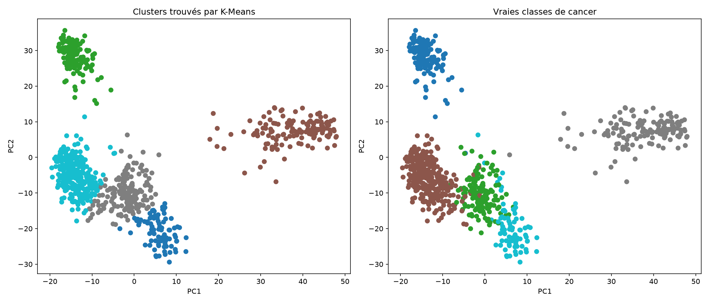
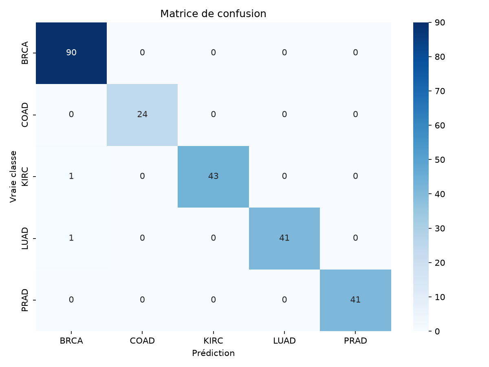

<<<<<<< HEAD
# 🧬 Pan-Cancer Gene Expression Classifier
Predicting cancer type from RNA-Seq gene expression profiles using unsupervised and supervised machine learning, with a full ML → API pipeline in progress.

**Status:** 🚧 In development — ML pipeline complete, API/deployment in progress (see Roadmap)

**Tools:** Python 3.11 · Pandas · NumPy · Scikit-learn · Matplotlib · Seaborn · Conda
**Data:** UCI Gene Expression Cancer RNA-Seq (TCGA PANCAN) · 801 samples · 20,531 genes · 5 cancer types

---

## Biological Question
Can gene expression profiles alone distinguish between five different cancer types — without any prior clinical information — using standard machine learning methods?

This is a classic pan-cancer genomics problem: RNA-Seq measures the activity level of thousands of genes simultaneously, and different cancer types are known to have distinct transcriptomic signatures. This project tests whether that signal is strong enough to separate cancer types both visually (unsupervised) and predictively (supervised).

---

## Dataset

| Metric | Value |
|---|---|
| Source | UCI Machine Learning Repository — Gene Expression Cancer RNA-Seq |
| Origin | TCGA Pan-Cancer Analysis Project, Illumina HiSeq platform |
| Samples | 801 |
| Genes (features) | 20,531 |
| Missing values | 0 |
| Cancer types | 5 |

### Class Distribution (imbalanced)

| Class | Full name | Count |
|---|---|---|
| BRCA | Breast invasive carcinoma | 300 |
| KIRC | Kidney renal clear cell carcinoma | 146 |
| LUAD | Lung adenocarcinoma | 141 |
| PRAD | Prostate adenocarcinoma | 136 |
| COAD | Colon adenocarcinoma | 78 |

> Note: this imbalance is handled explicitly in the modeling stage (stratified train/test split, class-weighted classifier) rather than ignored.

---

## How the Pipeline Works

```
Raw Data (UCI zip)              801 samples × 20,531 genes
        ↓
   Download + Cache             Direct download (bypassing a broken
                                 ucimlrepo import for this dataset),
                                 zip/tar extraction, local caching
        ↓
   Log-Transform                log2(x + 1) — compresses the highly
                                 skewed RNA-Seq expression distribution
        ↓
   Variance Filtering           20,531 → 2,576 genes — keeps only
                                 genes with informative variation
        ↓
   Standardization              Zero mean, unit variance per gene
        ↓
   ┌─────────────────┬─────────────────────┐
   ↓                                       ↓
PCA + K-Means                    Random Forest Classifier
(unsupervised check)             (supervised prediction)
   ↓                                       ↓
Cluster vs. true-class           Stratified train/test split
comparison plot                  Confusion matrix + F1 per class
```

---

## Results

### 1 — Unsupervised Check: PCA + K-Means

| Metric | Value |
|---|---|
| PCA components | 2 |
| Variance explained (PC1 + PC2) | 23.85% |
| Clustering method | K-Means (k=5, no labels used) |



**Interpretation:** Two cancer types (KIRC, PRAD) form tight, well-isolated clusters that K-Means recovers almost perfectly without ever seeing the true labels. Three types (BRCA, LUAD, COAD) occupy a partially overlapping region in 2D — biologically plausible, since these tissues can share broader transcriptomic programs. This confirms a real, detectable biological signal exists before any supervised modeling is attempted.

### 2 — Supervised Classification: Random Forest

| Metric | Value |
|---|---|
| Model | Random Forest (200 trees, class-weighted) |
| Train/test split | 70/30, stratified by class |
| Overall accuracy | 99% |
| Macro F1-score | 0.99 |

| Class | Precision | Recall | F1-score | Support |
|---|---|---|---|---|
| BRCA | 0.98 | 1.00 | 0.99 | 90 |
| COAD | 1.00 | 1.00 | 1.00 | 24 |
| KIRC | 1.00 | 0.98 | 0.99 | 44 |
| LUAD | 1.00 | 0.98 | 0.99 | 42 |
| PRAD | 1.00 | 1.00 | 1.00 | 41 |



**Interpretation:** Only 2 misclassifications out of 241 test samples (1 KIRC → BRCA, 1 LUAD → BRCA). Notably, COAD — the minority class with only 78 total samples — is classified perfectly, confirming the class-weighted approach successfully compensated for the imbalance rather than the model simply defaulting to the majority class.

> **Methodological note:** variance filtering and standardization were currently fit on the full dataset before the train/test split. A stricter version of this pipeline would fit these steps on the training set only, then transform the test set — planned as a refinement pass before final release, to rule out any inflated scores from data leakage.

---

## Project Structure

```
pancancer-genomic-classification/
│
├── README.md
├── environment.yml                 ← conda environment (pancancer-genomics)
│
├── src/
│   ├── config.py                   ← paths, constants, random seed
│   ├── data_loading.py             ← download, cache, sanity-check dataset
│   ├── preprocessing.py            ← log-transform, variance filter, scaling
│   ├── clustering.py               ← PCA + K-Means, comparison plot
│   └── classification.py           ← train/test split, Random Forest, evaluation
│
├── notebooks/                      ← exploratory work
├── reports/                        ← write-ups
│
├── data/
│   ├── raw/                        ← downloaded dataset (gitignored)
│   └── processed/                  ← cleaned/cached data
│
└── results/
    ├── figures/
    │   ├── pca_clusters_comparison.png
    │   └── confusion_matrix.png
    └── tables/
```

---

## Reproduce This Analysis

### Requirements
- Linux or WSL2 (Ubuntu 22.04 / 24.04)
- Miniconda

### Setup

```bash
git clone https://github.com/moumouh6/pancancer-genomic-classification.git
cd pancancer-genomic-classification

conda env create -f environment.yml
conda activate pancancer-genomics
```

### Run the pipeline

```bash
python src/data_loading.py       # downloads + caches the dataset
python src/clustering.py         # PCA + K-Means, saves comparison plot
python src/classification.py     # trains Random Forest, saves confusion matrix
```

---

## Tools & Versions

| Tool | Role |
|---|---|
| Python 3.11 | Core language |
| Pandas / NumPy | Data manipulation |
| Scikit-learn | PCA, K-Means, Random Forest, metrics |
| Matplotlib / Seaborn | Visualization |
| Conda | Environment management |

---

## Roadmap

| Stage | Status |
|---|---|
| Data loading + sanity checks | ✅ Done |
| Preprocessing (log-transform, variance filter, scaling) | ✅ Done |
| Unsupervised check (PCA + K-Means) | ✅ Done |
| Supervised classification (Random Forest) | ✅ Done |
| Model serialization + FastAPI serving endpoint | 🔜 In progress |
| Minimal frontend for live demo | 🔜 Planned |
| Dockerization + public deployment | 🔜 Planned |
| Full documentation pass + reproducibility polish | 🔜 Planned |

---

## Scientific Context

This project reproduces a well-studied benchmark problem in cancer genomics: multi-class tumor classification from RNA-Seq gene expression, using the TCGA Pan-Cancer dataset distributed via the UCI Machine Learning Repository. This type of pipeline — expression-based classification — is directly relevant to genomic surveillance and precision medicine work carried out by institutions such as the Institut Pasteur d'Algérie (IPA), bridging computational methods with practical diagnostic and research applications.
=======
# pancancer-genomic-classification
>>>>>>> 72c3c9d07720076f5d07042bfa112981c6b75408
